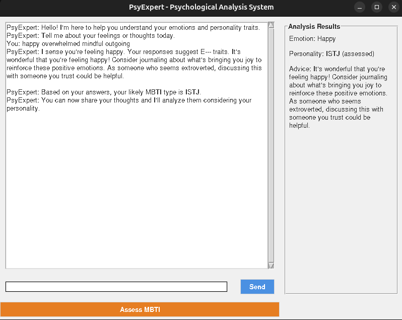

# PsyExpert - Psychological Analysis System


## Overview
PsyExpert is a rule-based expert system that analyzes emotions and personality traits from textual input. Using carefully crafted heuristics and MBTI (Myers-Briggs Type Indicator) principles, it provides psychological insights and personalized advice without relying on machine learning models.

## Features

- **Emotion Detection**: Identifies 7 core emotional states from text input
- **MBTI Personality Analysis**: Assesses personality traits across 4 dimensions
- **Interactive GUI**: Conversation-style interface with real-time analysis
- **Psychological Advice**: Provides tailored recommendations based on emotions and personality
- **Personality Assessment**: Includes a dedicated MBTI questionnaire

## Installation

1. Ensure you have Python 3.8+ installed
2. Clone this repository:
   ```bash
   git clone https://github.com/Khushboo-Dar/PsyExpert.git
